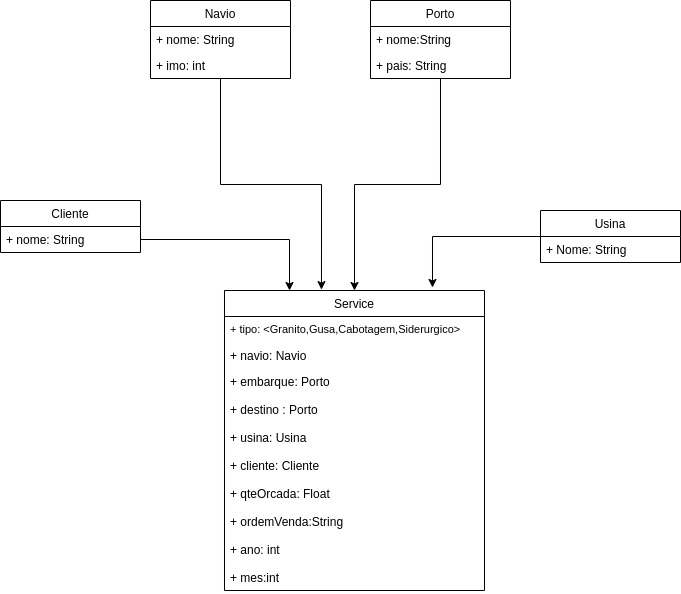
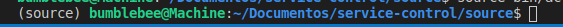
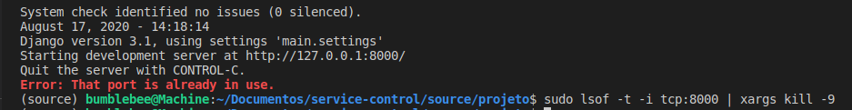

# controle de serviços 

1. Documentação
2. Justificativas
3. Build

## Documentação
### Minimundo
O planejamento portuário precisa organizar os Serviços na operação e movimentação do navio. Com o grande volume de Serviços, continuar controlando em planilhas é um trabalho mais demorado e você também não consegue ter uma base de dados centralizada alinhadas com outras necessidades do negócio.

Até o momento temos 4 serviços: Cabotagem, Granito, Gusa e Siderúrgico e todo serviço é associado a um navio já contratado. Alinhe o escopo de dados para o cadastro do Serviço.

O desejo de solução é um tipo de ficha, onde o usuário terá que inserir os seguintes dados de cada Controle de Serviço ao ser cadastrado: Mês, Ano, Nome Porto Embarque, Nº Ordem Venda, Nome Cliente, Nome Porto Destino, Nome Navio, Nome Usina, Nome Serviço e Quantidade Orçada [toneladas].

|Nome servico|Mês|Ano| Porto embarque | Porto destino | Ordem venda | Cliente  | Nome navio |  Nome usina |  qte Orçada |
|---|---|---|---|---|---|---|---|---|---|
| Cabotagem |  07 | 2020  | Santos | Recife  | 0100AB  | ServiceLTDA |  Perola negra | Usina 1 | 15 |
| Granito |  07 | 2020 | Vitória | Santos | 27BC  | CenterLTDA | Holandes voador | Usina 2  | 4,5  |
| Gusa  |  07 | 2020 | Recife | Vitória  |  0007 | MainSA | Titanic  |  Usina 3 | 24 |

Ter as opções de cadastro caso não exista: Navio[nome, IMO], Porto Embarque[nome, país], Porto Destino[nome, país], Cliente[nome] e Usina[nome].
<br><br><br><br>

### Modelagem

<br><br><br><br>

### Regras de negócio
| ID | Descrição  |
|---|---|
| RN01  | Utilize algumas das seguintes stacks: Django, Python, PostgreSQL, Html, CSS e JavaScript. |
| RN02 | Em relação aos dados, estes deverão serem armazenados em banco de dados PostgreSQL. |
<br><br><br><br>

### Requisitos
| ID | Descrição  |
|---|---|
| RF01 | O sistema deve permitir cadastrar um novo navio com nome e número IMO  |
| RF02 | O sistema deve permitir o cadastro de um cliente com apenas o nome |
| RF03 | O sistema deve permitir o cadastro de um porto com nome e país, seja ele um destino ou um embarque |
| RF04 | O sistema deve mostrar os dados de todos os serviços para o usuário |

<hr>

## Justificativas
Eu acredito fortemente que o backend não deve conter muitas operações complexas, por um motivo muito simples, buscar um custo mais baixo. 

Sendo assim processamento e filtragem de dados, são responsabilidade do frontend, mesmo a vaga sendo de backend eu fiz para mostrar como fica interessante desta forma.

Hoje o limitante de performace é o banco de dados gratuito que eu uso, elephantsql uma hospedagem gratuita de banco de dados até 20MB, o delay entre cadastrar e reaparecer na tela é um pouco lento,mas usando um banco melhor isso é resolvido, eu elaborei a minha solução como uma SPA(single page aplication) as operações são muito rapidas sempre, levo todos os dados de uma vez.

Numa visão a longo prazo pode ser um gargalo mas não é um limitante visto que podemos elaborar outras técnicas para reduzir isso com local storage.
<br> 

O modelo da solução é meio anêmico por esse motivo achei desnecessário colocar colocar coisas pequenas cada [django-app] elaborei um unico app com todas as classes,conforme o crescimento do sistema veremos se é interessante dividir isso, 
praticamente os unicos arquivos de uso são:view, models, index. 


Qualidade de Código e Testes: Infelizmente, essa parte é pouco abordada na faculdade, não realizei testes unitários. 

Adorei o desafio gostaria de tentar embelezar minha solução e num segundo momento,mesmo usando umas técninas bem legais com JS, gostaria de usar como meu portifolio, obrigado pela oportunidade com django.


## Build
O banco é em nuvem então não é necessário nada relacionado a ele.<br>
Foi utilizado um ambiente virtual, caso não saiba o que é um ambiente virtual, tem esse link aqui.
[ambientes virtuais no python3](https://pythonacademy.com.br/blog/python-e-virtualenv-como-programar-em-ambientes-virtuais#).

```ambientes windows use o power shell```

Da raiz do projeto 
```
> cd source/
> source bin/activate
```
caso tudo ok um ```(source)``` deverá aparacer a esquerda.<br>
<br>
vá para pasta projeto.
```
cd projeto
```
Execute o comando para abrir a aplicação
```
python3 manage.py runserver
```
caso tenha esse erro em específico faça o comando a baixo e rode novamente o servidor.

em caso de dúvidas entre em contato comigo [contato](https://github.com/MarceloMendes94/MarceloMendes94).